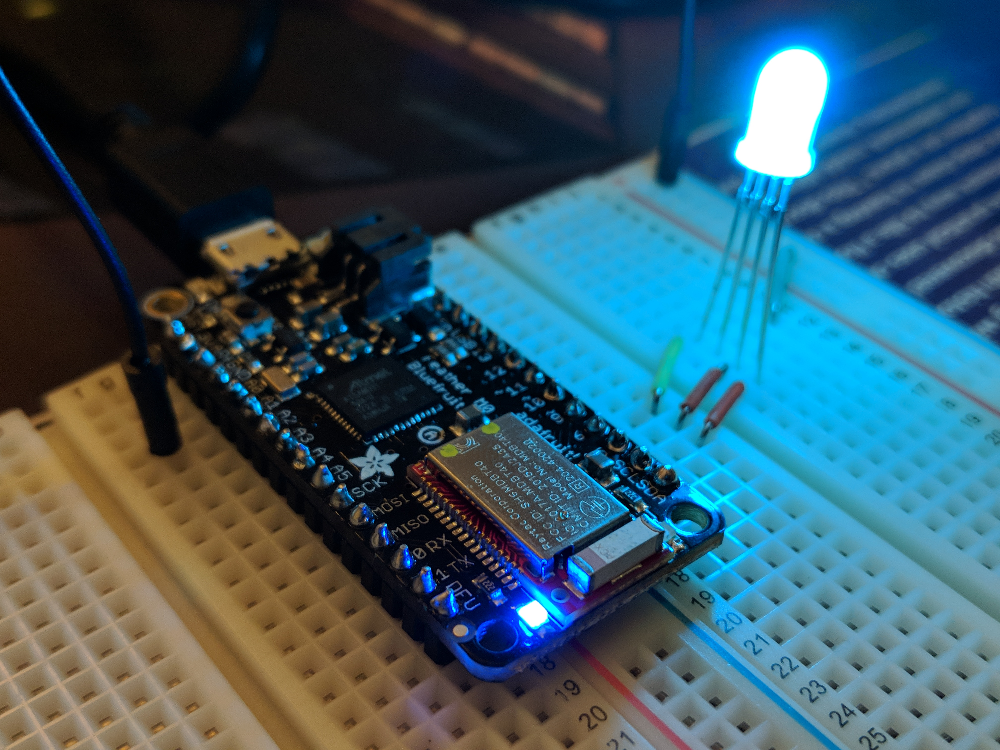

# LED Color Sequence
This project enables the app users to send a sequence of colors to an LED circuit that uses Adafruit's Feather M0 Bluefruit LE board.

<h2>Prerequisites</h2>

This project relies on the Arduino IDE and MIT's App Inventor. During the time this project was built, App Inventor only supported Android phones.

<h2>Built With and Components</h2>
<ul>
    <li>Adafruit Feather M0 Bluefruit LE board</li>
    <li>MIT App Inventor</li>
    <li>RGB LED</li>
</ul>

<h2>Acknowledgments</h2>
<ul>
    <li>Bluetooth implementation in App Inventor by Gerriko: https://www.hackster.io/gerrikoiot/ble-gp-o-controller-mit-app-inv-feather-m0-bluefruit-le-4fba5e</li>
    <li>Decided to use App Inventor instead of creating an Android app because of project deadline</li>
</ul>

<a href="https://youtu.be/p9CLgh7IIFw">Video demo</a>